# YubiSign

Yubikey 5.8 powered PDF signing with ARKG

YubiSign is a Python application with web interface that leverages Yubikey 5.8's PreviewSign Extension with Asynchronous Remote Key Generation (ARKG) to sign PDF documents. While the demonstration is only for PDF signing, the project lays the framework for generating X509 certificates for standard digital signing workflows.

# Problem solved:

Document signature, especially PDF files have been one of the most widely used operations with Public Key cryptography. It has been used time and again to prove the validity and legitimacy of documents. However, signing the same with hardware-backed cryptography in a reliable way has been a challenge so far. Some solutions required extensive setups involving PIV cards, HSMs etc., to usage of applications like GnuPG. 

This project aims at streamlining the workflow for signing documents. It leverages the WebAuthn PreviewSign extension with ARKG to sign PDF files with a Yubikey. It leverages standard PKCS#7 operations, making the signatures compliant with PDF/A technology, verifiable with PDF readers like Adobe Acrobat readers.

The advantages of using YubiSign:
- Secrets are hardware backed: Private keys are securely stored in the Yubikeys and cannot be extracted or easily compromised. The signing happens in the Yubikey.
- Easy of use: Extensive setups with PIV, GnuPG, etc., is not required for reliable PDF signing.
- Unlinkability: Multiple self-signed certificates and keypairs for PDF signing can be made from a single FIDO credential with ARKG, where they cannot be cryptographically linked.

## Secondary problem statement

While this problem is not related to the chosen problem statement, it was instrumental in fast development of the solution. I am developing on a Windows system. Windows FIDO2 client implemented under `webauthn.dll` does not support the `PreviewSign` extension and drops the calls. The only way to use it was to run the application with elevated privileges. Now running a whole python application which potentially interacts with artifacts from the internet (PDF Files) and uses the `pickle` library with elevated privileges is definetely a terrible idea. (I know I should have used better serialization than `pickle` but shortage of time in this hackathon forced me to use it.) It could make the application an easy target for RCE vulnerabilities. Hence, I developed an IPC based daemon which ran using `system` privileges, thus not fully-elevated but allows direct CTAP access over HID channels. 

The same is mentioned in the codebase at [IPC Calls](https://github.com/AdityaMitra5102/YubiSign/blob/main/yubisign.py#L21). Installing the IPC Daemon can be done by installing the `python-fido2` library from my fork and branch at [Repo](https://github.com/AdityaMitra5102/python-fido2/tree/namedpipe#installation). Keeping the daemon active ensures the application can run directly without having to run with elevated privileges.

# Yubikey 5.8 specific feature

The project uses the PreviewSign extension and ARKG to sign documents and to create unlinkable keypairs from same credential, respectively. This is achieved by creating a `Signer class` that internally uses the PreviewSign extension but is exposed as a subclass of `EllipticCurvePrivateKey`. Thus, it can be used by other libraries like `endesive` for PDF signing, or similar for other general purpose cryptographic signatures.

```py
class YubikeySigner(ec.EllipticCurvePrivateKey):
    def __init__(self, public_key: ec.EllipticCurvePublicKey):
        self._public_key = public_key

    def public_key(self):
        return self._public_key

    @property
    def key_size(self):
        return self._public_key.key_size

    def set_args(self, args):
        self.args = args

    def sign(
        self, data: bytes, signature_algorithm: ec.EllipticCurveSignatureAlgorithm
    ):
        client, info = get_client(
            lambda info: PreviewSignExtension.NAME in info.extensions,
            extensions=[PreviewSignExtension()],
        )

        request_options, state = server.authenticate_begin(
            self.args.credentials, user_verification=uv
        )
        digest = hashes.Hash(hashes.SHA256())
        digest.update(data)
        ph_data = digest.finalize()
        result = client.get_assertion(
            {
                **request_options["publicKey"],
                "extensions": {
                    PreviewSignExtension.NAME: {
                        "signByCredential": {
                            websafe_encode(self.args.credentials[0].credential_id): {
                                "keyHandle": self.args.key_handle,
                                "tbs": ph_data,
                                "additionalArgs": cbor.encode(self.args.args),
                            },
                        },
                    }
                },
            }
        )
        result = result.get_response(0)

        sign_result = result.client_extension_results[PreviewSignExtension.NAME]
        signature = websafe_decode(sign_result.get("signature"))
        server.authenticate_complete(state, self.args.credentials, result)
        return signature

    def exchange(self, algorithm: ec.ECDH, peer_public_key: ec.EllipticCurvePublicKey):
        raise NotImplementedError()

    @property
    def curve(self):
        return self._public_key.curve

    def private_numbers(self):
        raise NotImplementedError()

    def private_bytes(
        self,
        encoding: serialization.Encoding,
        format: serialization.PrivateFormat,
        encryption_algorithm: serialization.KeySerializationEncryption,
    ) -> bytes:
        raise NotImplementedError()

    def __copy__(self):
        raise NotImplementedError()

    def __deepcopy__(self, memo: dict[Any, Any]):
        raise NotImplementedError()
```

The above shows the implementation of the signer class as a subclass of `EllipticCurvePrivateKey` which facilitates the usability.

Another important feature used is since CTAP 2.2, `MakeCredential` calls do not require UV or pin mandatorily (except for discoverable credentials). This makes the flow very seamless and done not prompt the user for pin inputs.

# Setup instructions

Follow the below instructions to install  YubiSign

- Clone the repository with 

`git clone https://github.com/AdityaMitra5102/YubiSign.git`

- Go inside the directory

`cd YubiSign`

- Install dependencies (you may have to use `python3` instead of `python` in some linux systems.)

`python -m pip install requirements.txt`

- [On linux systems] Set up `udev` rules to allow access to `HIDRAW` devies for direct CTAP Access

- Launch the application [Use elevation in Windows]

`python yubisign.py`

- A web browser is supposed to open automatically. If it doesn't open, navigate to `http://localhost:5000` or click [here](http://localhost:5000).

## [Optional, Windows only] Set up IPC Daemon to be able to run the application without elevation.

Ideally you would follow the instructions [here](https://github.com/AdityaMitra5102/python-fido2/tree/namedpipe#installation) but summarizing the steps below for fast setup.

- Clone my fork of `python-fido2`

`git clone https://github.com/AdityaMitra5102/python-fido2`

- Go in the directory

`cd python-fido2`

- Switch to the branch that supports IPC.

`git branch namedpipe`

- Install it with dependencies for IPC

`python -m pip install .[win] --upgrade`

- From an elevated terminal install and start the IPC

`python -m fido2.ipcservice.service --startup auto install`

`sc start CTAPIPCService`

Now since the IPC Daemon is running, you may start YubiSign by running `python yubisign.py` from a non-elevated terminal.

# Running instructions

This doesn't really need any instruction. The application presents a GUI on a web interface. On-screen instructions are to be followed. Keep the Yubikey with firmware 5.8 connected for the keygen and signing processes. Ideally when generating a keypair with ARKG from a previously generated credential, you wouldn't need the Yubikey but this application automatically generates a self-signed certificate. The key is required for this certificate signing process.

- Opening the application presents the homepage:

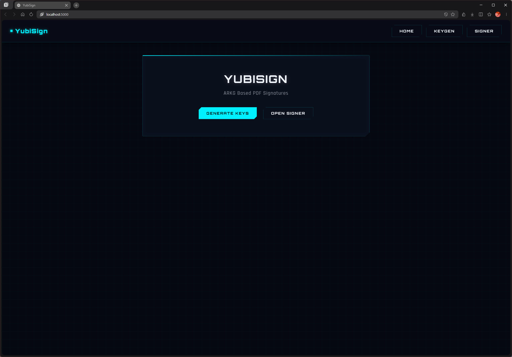

## Key generation from Yubikey

- To generate a new keypair, go to `Generate Keys`. By default it would be on the `Generate from Yubikey`tab which would run a fresh `MakeCredential` call.

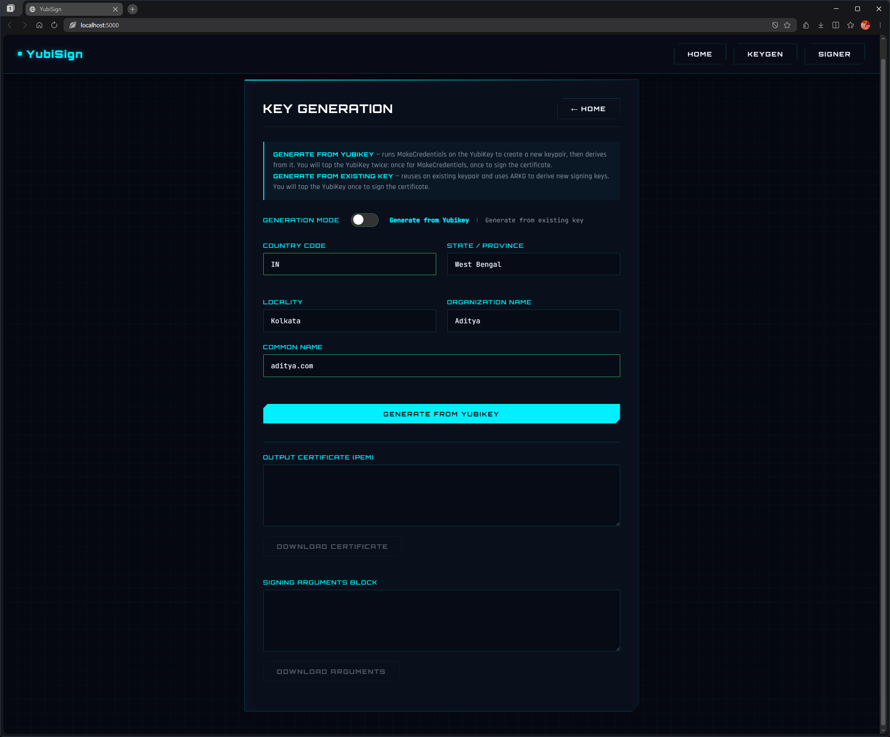

- Fill in the details for the certificate and click on `Generate From Yubikey`

- Tap the Yubikey when it blinks. It will blink twice: the first time when running the MakeCredential call, the second time for signing the certificate. The generated certificate and "arguments" will be displayed. The "arguments" is basically a combination of items required to identify the signing key in the Yubikey.

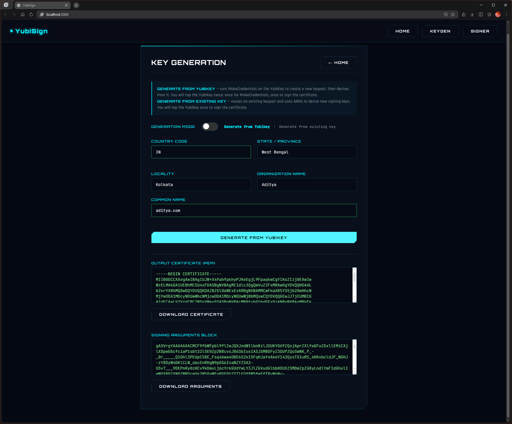

- Both files can be downloaded. Downloading the certificate is required to be able to verify signed PDFs later. However, it is ok even if it is not downloaded at the moment. It can be retrieved from the "arguments" later. 

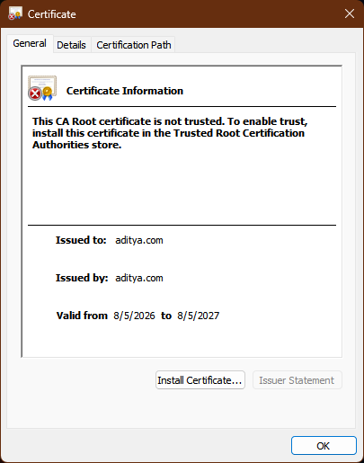

Similarly downloading the "arguments" is not required at the moment. If using only one keypair, the arguments is stored in the browser cookies. However, it is recommended to download it, since if it is lost, the generated key pair cannot be used anymore.

## Key generation from an existing credential (ARKG)

- To generate a new unlinkable keypair from an existing credential, go to the `Generate from existing key` tab in `Generate Keys` section.

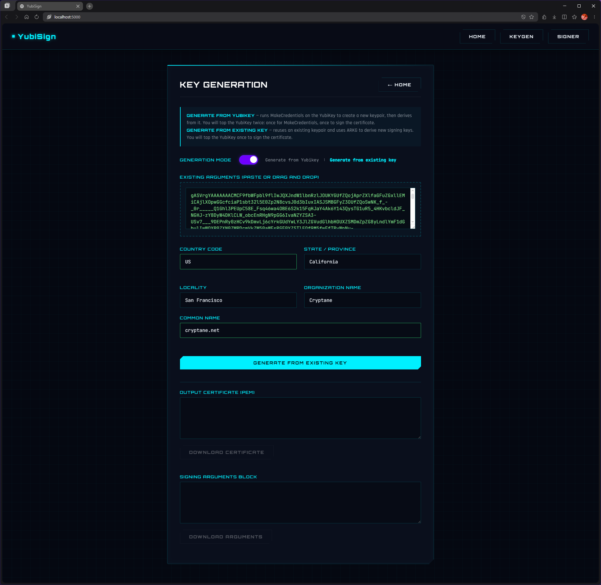

- Paste or drag and drop the "arguments" file of the previous keypair in the required box and fill the details for the new certificate.

- Click `Generate from existing key`

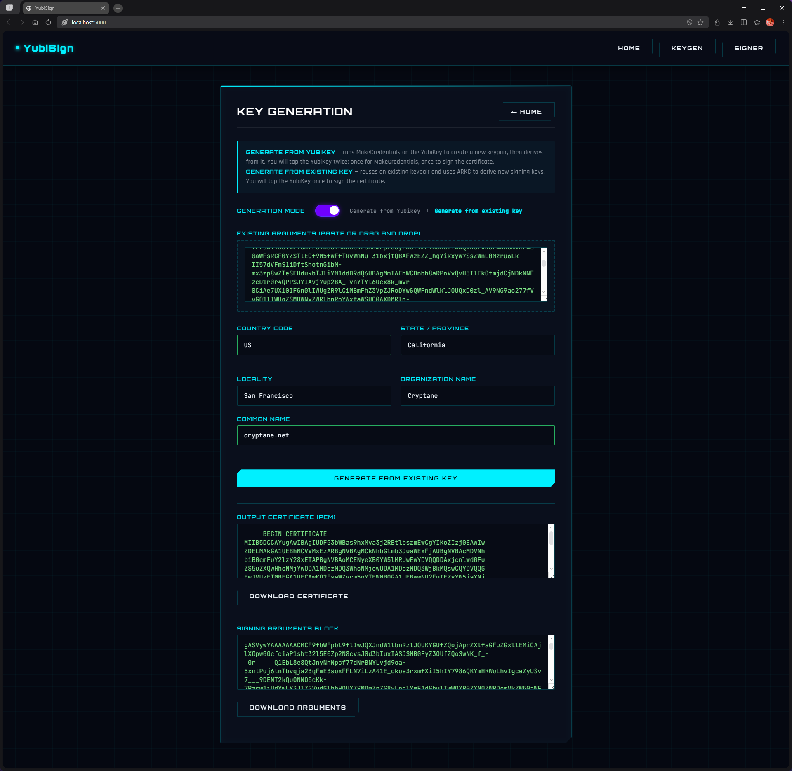

- New certificate and arguments will be generated. It can be downloaded similar to the previous section.

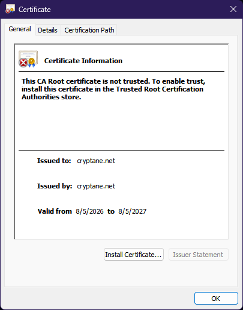

## Certificate recovery

This step is to be used if the certificate was not downloaded previously and you need it to verify the signed documents.

- Go to the `Signer` tab.

- Paste or drag and drop the arguments.

- Click `Download Certificate`.

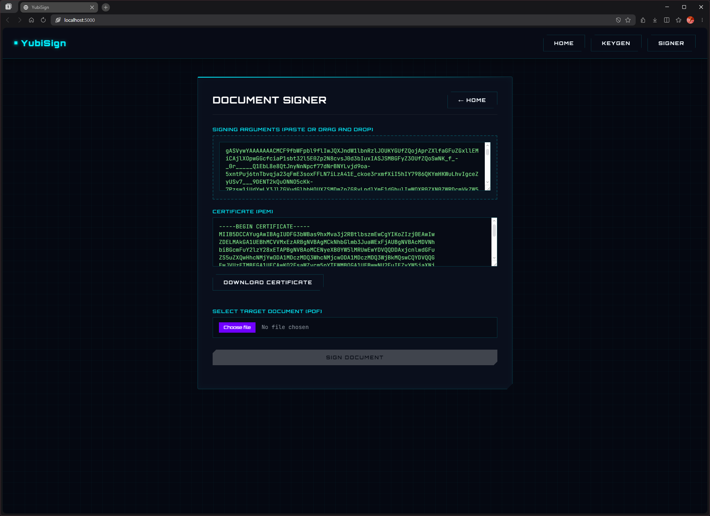

## Adding certificates to trust store

Certificates are needed to be trusted to use it to verify signatures. This has no fixed procedure. Instead, users are recommended to follow the procedure mentioned by their operating system or PDF reader.

The guide for Adobe Reader is available [here](https://helpx.adobe.com/in/acrobat/using/trusted-identities.html).

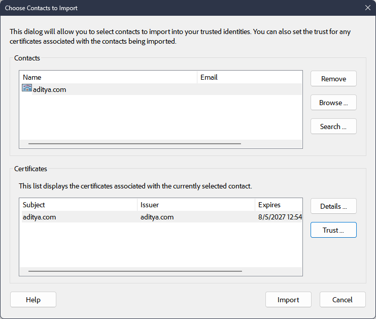

## Signing documents

- Open the `Signer` tab and drag and drop or paste the arguments of the key to be used to sign.

- Choose the PDF file.

- Click `Sign Document`.

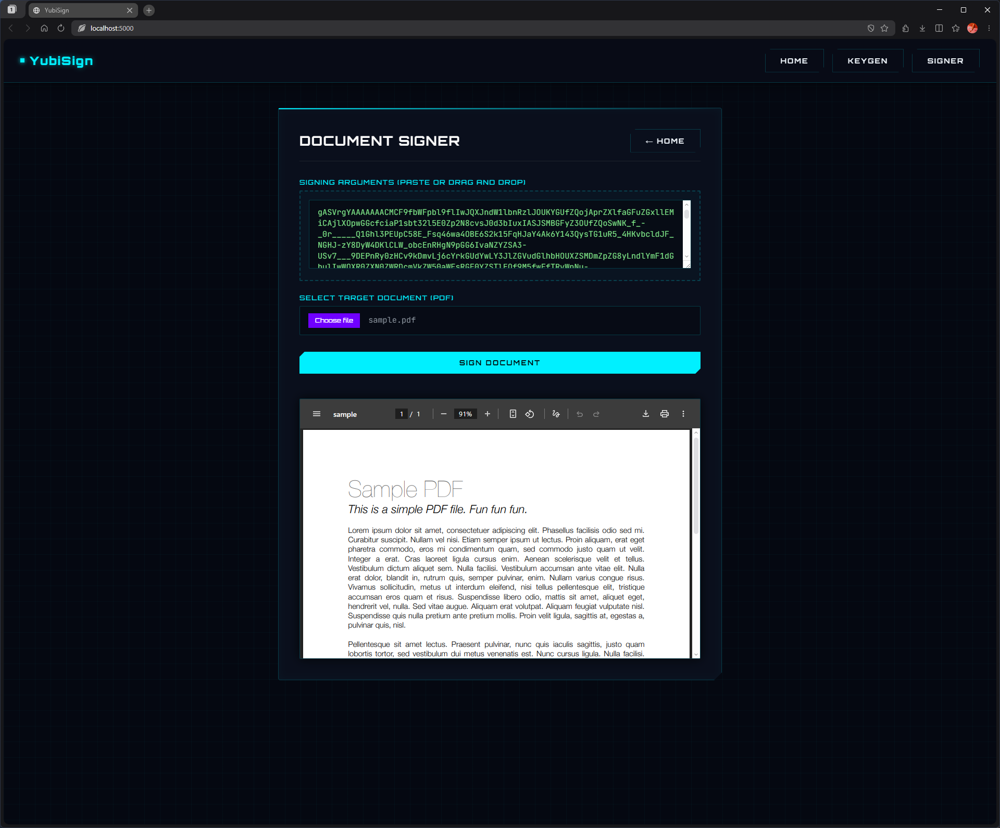

## Verifying signatures

If the certificates are added to the trust store, opening the signed documents in the PDF reader would show the verification information.

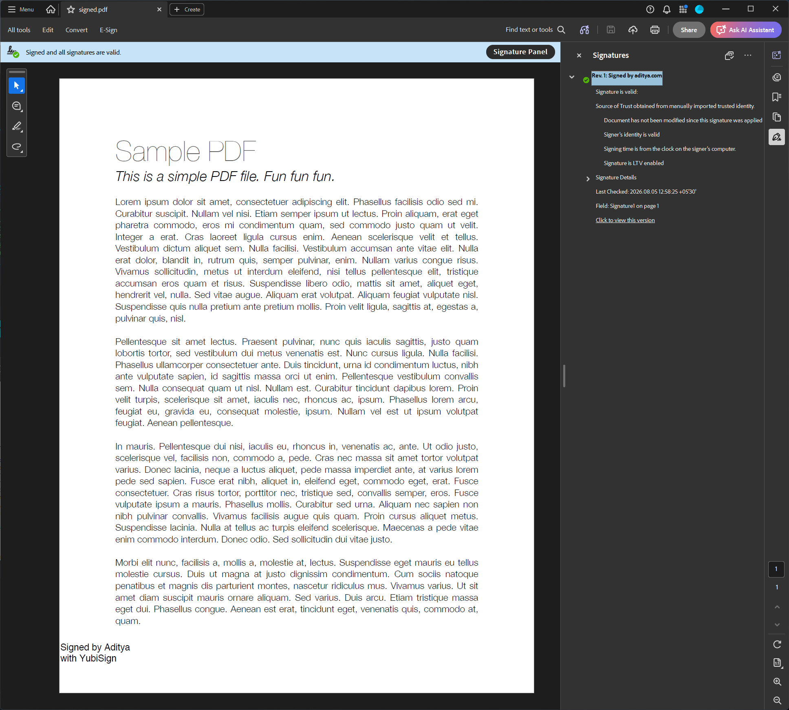


Alternatively, if the certificate is not added, the signer may publish the hash of the certificate. The verifier may match the hash against the one shown in the PDF reader.

For example the signer may publish the SHA 1 digest of the certificate:

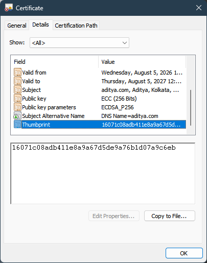

And the verifier may verify the same against the one shown in the PDF reader.

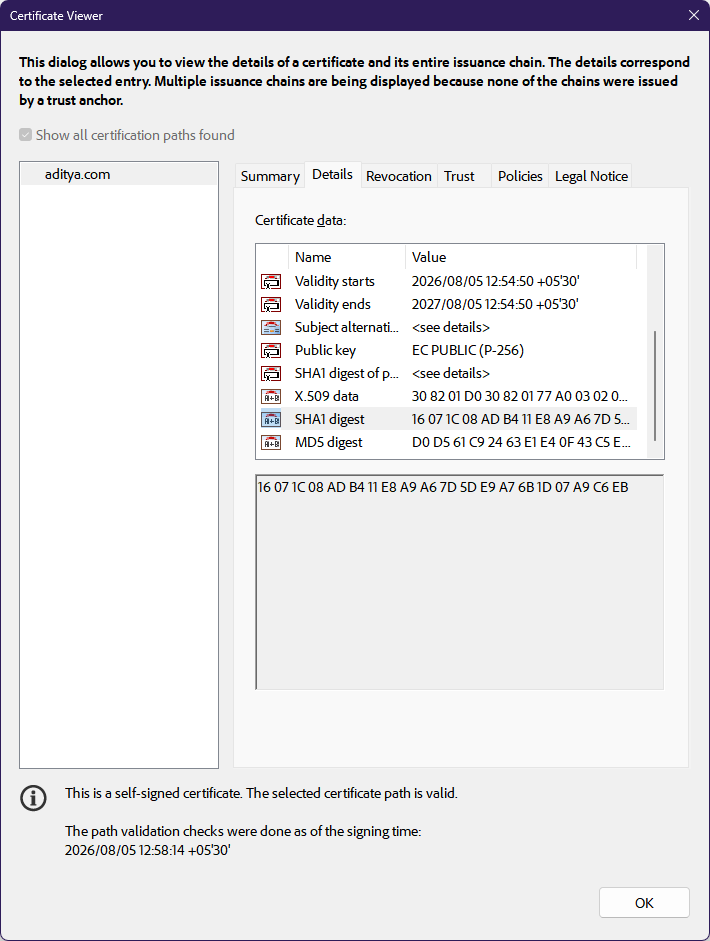

# Tech Stack and dependencies

The application is a pure `python` application with a Web UI. The dependencies include:

- `Flask` for hosting the application locally in the form of a web ui.
- `Endesive` for signing PDF documents.
- `Cryptography` library of Python for handling cryptographic operations.
- `Python-Fido2` library for interacting with the authenticator.
- `Pickle` because I didn't have time to define a serialization format for the "arguments" for this hackathon. For production use, a suitable serialization format is recommended.

The Web UI uses vanilla JS and CSS.

# Validation

The PDF file available [here](verification/signed.pdf) has been signed with **YubiSign**. The corresponding X.509 certificate is available [here](verification/cert.crt). It may be used to verify the signature.

# Help used:

The following resources were used in development of the project and learning:

- [Python-FIDO2 Library](https://github.com/yubico/python-fido2)
- [ARKG Algorithm](https://datatracker.ietf.org/doc/draft-bradleylundberg-cfrg-arkg/)
- [PreviewSign extension](https://pr-preview.s3.amazonaws.com/w3c/webauthn/pull/2078.html#sctn-sign-extension)
- UI/ CSS has been done with the help of GenAI Chatbots Claude and Grok, free tier.

# Learnings

Over the course of the past few days (I started tinkering the moment I received the Yubikey), I spent my time reading the CTAP 2.3 specifications, the PreviewSign draft by Yubico and the ARKG Algorithm IETF Draft by Emil Lundberg and John Bradley. I really liked the mathematical assumptions behind the algorithm. It wasn't my first time using the `python-fido2` library. But the example codesbases for ARKG helped me understand the practical applications behind the mathematics. Apart from that, the blocker I hit for current browsers and the Windows Hello `webauthn.dll` stack dropping the `PreviewSign` extension encouraged me to develop the IPC based transport (Though I have been working on it from before the hackathon as well because this blocker isn't new. Windows doesn't provide any native way to access Discoverable Credentials either.) 

